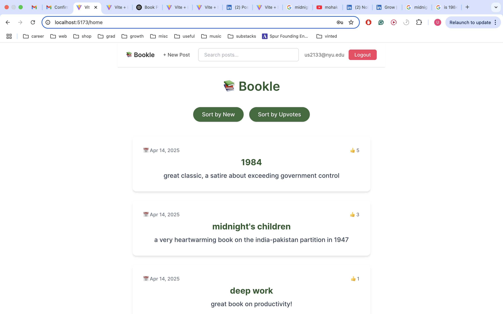
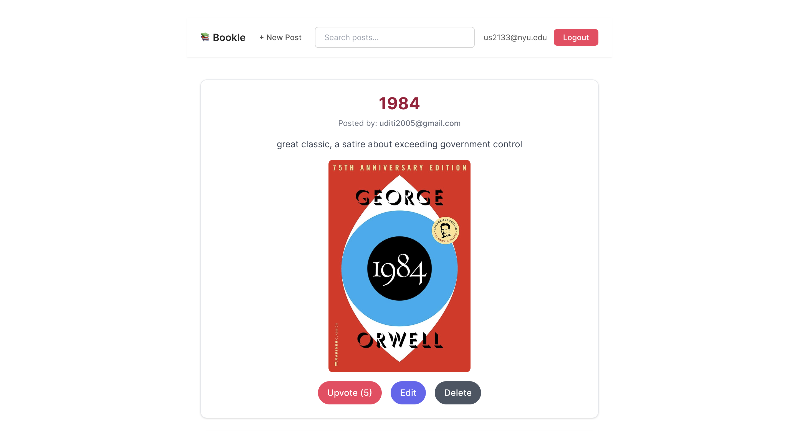
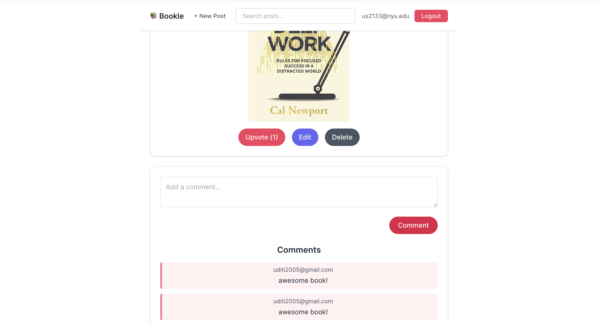

# 📚 Bookle — A Goodreads-Inspired Book Sharing App

Bookle is a minimalist, full-stack book-sharing app inspired by Goodreads. Users can create and upvote book posts, comment on others' entries, and explore community recommendations — all within a clean, modern UI.

## ✨ Features

•⁠  ⁠🔐 User authentication (email + password) via Supabase
•⁠  ⁠📝 Create, edit, and delete book posts with image URLs
•⁠  ⁠💬 Comment system with visible author email
•⁠  ⁠👍 Upvote system for logged-in users
•⁠  ⁠🔍 Live search by book title
•⁠  ⁠🧑 Author attribution on posts and comments
•⁠  ⁠💅 Responsive and aesthetic UI using TailwindCSS

## ⚙️ Technologies Used

•⁠  ⁠*Frontend*: React, Vite, TailwindCSS
•⁠  ⁠*Backend*: Supabase (PostgreSQL, Auth)
•⁠  ⁠*Authentication*: Supabase Auth
•⁠  ⁠*Database*: Supabase Tables with Row-Level Security (RLS)

## 🖼️ Screenshots

### 🏠 Homepage — Book Feed
Explore the feed of books posted by users. Sort by newest or most upvoted.

### 📘 Book Post — Full View
View post content, image, and post author. Add or read comments.

### 💬 Comments Section
Leave your thoughts on a book or read what others have said.

## 🚀 Running the App Locally

### 📁 Clone the Repo
⁠ bash
git clone https://github.com/yourusername/bookle.git
cd bookle
 ⁠

### 📦 Install Dependencies
⁠ bash
npm install
 ⁠

### 🔐 Set Up Supabase
1.⁠ ⁠Go to https://supabase.com and create a new project.
2.⁠ ⁠Copy your anon/public API key and Supabase project URL into a .env file like this:

⁠ env
VITE_SUPABASE_URL=https://your-project.supabase.co
VITE_SUPABASE_ANON_KEY=your-anon-key
 ⁠

3.⁠ ⁠Inside Supabase, create the following tables:

#### 📄 Table: profiles
<pre lang="markdown"> ### 🔐 Set Up Supabase 1. Go to [https://supabase.com](https://supabase.com) and create a new project. 2. Copy your ⁠ anon ⁠ public API key and Supabase project URL. 3. Add them to a ⁠ .env ⁠ file in your project root: ⁠ env VITE_SUPABASE_URL=https://your-project.supabase.co VITE_SUPABASE_ANON_KEY=your-anon-key  ⁠ --- ### 📄 Create These Tables in Supabase #### ⁠ profiles ⁠ Table | Column | Type | Notes | |----------|------|---------------------------------| | user_id | UUID | Primary Key, FK to ⁠ auth.users ⁠ | | email | text | Email of the user | --- #### ⁠ posts ⁠ Table | Column | Type | Notes | |------------|-----------|----------------------------------| | id | int8 | Primary Key | | title | text | Book title | | content | text | Review or thoughts | | image_url | text | Optional cover image | | created_at | timestamp | Default: ⁠ now() ⁠ | | upvotes | int8 | Default: 0 | | user_id | UUID | FK to ⁠ profiles.user_id ⁠ | --- #### ⁠ comments ⁠ Table | Column | Type | Notes | |----------|------|--------------------------| | id | int8 | Primary Key | | content | text | Comment content | | post_id | int8 | FK to ⁠ posts.id ⁠ | | user_id | UUID | FK to ⁠ profiles.user_id ⁠ | --- #### ⁠ upvotes ⁠ Table | Column | Type | Notes | |----------|------|--------------------------| | post_id | int8 | FK to ⁠ posts.id ⁠ | | user_id | UUID | FK to ⁠ profiles.user_id ⁠ | </pre>
### 🔐 Enable Row-Level Security (RLS)
Enable RLS on all tables, and create the following policies:

#### ✅ profiles Table
•⁠  ⁠*INSERT*:
⁠ sql
auth.uid() = user_id
 ⁠
•⁠  ⁠*SELECT*: Allow all authenticated users to view.

#### ✅ posts Table
•⁠  ⁠*INSERT*:
⁠ sql
auth.uid() = user_id
 ⁠
•⁠  ⁠*UPDATE & DELETE*:
⁠ sql
auth.uid() = user_id
 ⁠
•⁠  ⁠*SELECT*: Allow all users (or just authenticated)

#### ✅ comments Table
•⁠  ⁠*INSERT*:
⁠ sql
auth.uid() = user_id
 ⁠
•⁠  ⁠*SELECT*: Allow all users

## 🧪 Dev Notes
•⁠  ⁠Users must confirm their email before they can post.
•⁠  ⁠You must create a profiles row after sign-up to match the foreign key. This is handled in the frontend automatically.

## 💡 Future Features
•⁠  ⁠📚 Book genre tagging
•⁠  ⁠📖 Reading lists or shelves
•⁠  ⁠👤 User profiles & bios
•⁠  ⁠📈 Post analytics or trending books

## 🧑‍💻 Author
Made with ❤️ by Uditi Sharma
